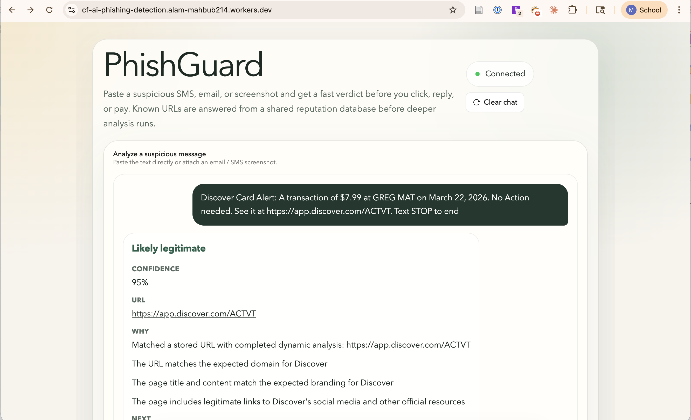
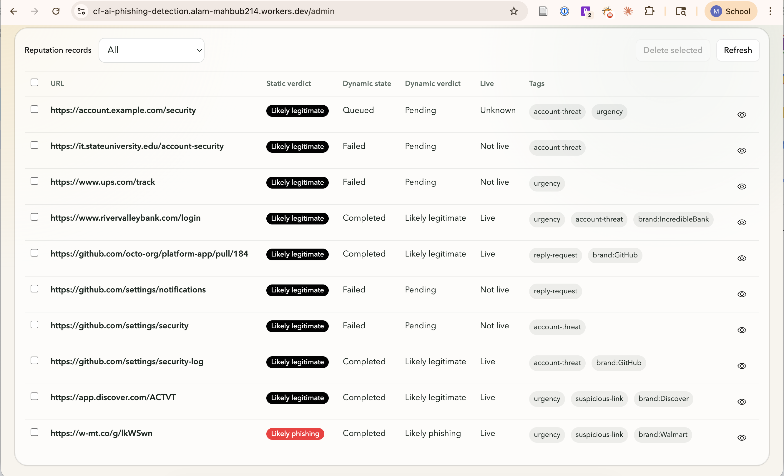
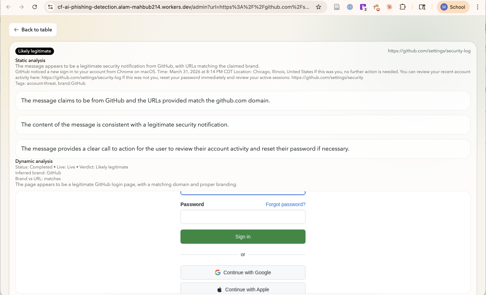

# PhishGuard

PhishGuard is a Cloudflare-native phishing detection app for suspicious SMS, email, and screenshot review.

It gives users a fast verdict before they click, reply, or pay. Known URLs are answered from a shared reputation database, and new URLs can be inspected later through a background dynamic-analysis workflow.

Live app: [https://cf-ai-phishing-detection.alam-mahbub214.workers.dev/](https://cf-ai-phishing-detection.alam-mahbub214.workers.dev/)

For a deeper technical walkthrough, see [ARCHITECTURE.md](./ARCHITECTURE.md).

## Features

- Paste suspicious SMS or email text
- Upload message screenshots
- Static phishing analysis with Workers AI
- Shared URL reputation database for cache hits
- Background dynamic URL analysis with Cloudflare Workflow
- Dynamic page inspection with Browser Rendering
- Private admin portal for reviewing stored records

## Screenshots

### Client app



### Admin dashboard



### Admin detail view



## Cloudflare services used

- Workers
- Agents SDK
- Workers AI
- Durable Objects
- Workflows
- Browser Rendering

## How it works

1. User submits suspicious content.
2. The app extracts the message text, URLs, and phishing indicators.
3. It checks the shared reputation database first.
4. If the URL or message is already known, it returns the stored verdict.
5. If it is new, the app runs static AI analysis and returns a verdict.
6. New URLs are queued for background dynamic analysis.

## Local setup

### Prerequisites

- Node.js 20+
- Cloudflare account
- Wrangler login

### Install

```bash
npm install
```

### Log in to Cloudflare

```bash
npx wrangler login
```

### workers.dev setup

Before remote dev or deploy, make sure your Cloudflare account has a `workers.dev` subdomain configured.

## Run locally

```bash
npm run dev
```

If Wrangler asks for remote mode and your account is not fully configured yet, switch to local mode or finish `workers.dev` onboarding first.

## Deploy

```bash
npm run deploy
```

After deployment, Cloudflare will return a public `*.workers.dev` URL for the app.

Current deployment:

- [https://cf-ai-phishing-detection.alam-mahbub214.workers.dev/](https://cf-ai-phishing-detection.alam-mahbub214.workers.dev/)

## Admin portal

The admin portal lives at `/admin`.

It shows:

- Stored URLs
- Static verdict
- Dynamic analysis state
- Dynamic analysis verdict
- Live/not-live status
- Tags and detail view

Protect it with Cloudflare Access:

- `/admin`
- `/admin/api/*`

## Project structure

```txt
src/
  server.ts      Main Worker, agent runtime, reputation store, admin API
  workflow.ts    Background dynamic URL inspection
  app.tsx        Public client and admin UI
  styles.css     App styling
ARCHITECTURE.md  Detailed implementation notes
PROMPTS.md       AI prompts used during development
wrangler.jsonc   Cloudflare configuration
```

## Notes

- This is a phishing screening assistant, not a guaranteed security verdict.
- Dynamic analysis runs in the background and does not block the initial user-facing result.
- Users should still verify important messages through official channels.
